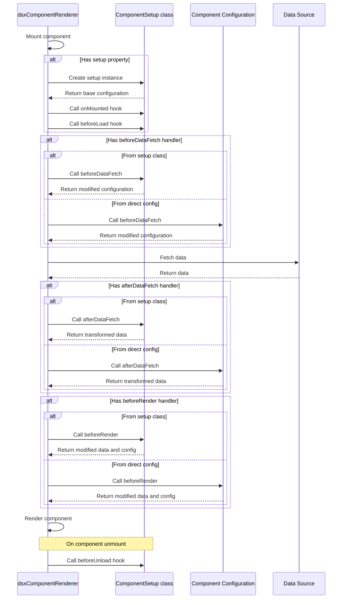

# Typus Dynamic Page Renderer System 

## Overview

The Typus Dynamic Page Renderer is a flexible system for creating and rendering UI pages using declarative JSON configurations. This approach allows developers to build complex interfaces without writing repetitive Vue component code, while maintaining full support for custom logic and data handling.

## Key Features

- **Declarative UI Configuration**: Define entire pages using JSON configuration
- **Component-Based Architecture**: Reuse standard UI components across the application
- **Dynamic Data Loading**: Fetch and transform data as needed for each component
- **Component Handlers**: Custom logic at different stages of component lifecycle
- **Component Setup Classes**: Reusable component configuration with encapsulated logic
- **Dynamic Slots**: Generate slot content based on data from dataSource
- **Event Handling**: Process component events with custom handlers
- **Parallel to Traditional Development**: Works alongside standard Vue components

## Architecture

The system consists of three primary renderer components:

1. **dsxPageRenderer**: Handles complete page rendering, including title and layout
2. **dsxBlockRenderer**: Manages blocks within the page layout
3. **dsxComponentRenderer**: Renders individual UI components with their props, events, and handlers

## Component Handlers

Components can now include custom handlers that execute at different stages of the component lifecycle:

- **beforeDataFetch**: Executes before data is fetched, can modify the component configuration
- **afterDataFetch**: Executes after data is fetched, can transform the data
- **beforeRender**: Executes before the component is rendered, can modify both data and configuration

### Handler Flow Diagram



## Component Setup Classes

Components can now use a setup class to encapsulate configuration and logic:

```typescript
// Define a component setup class
export class MyComponentSetup extends ComponentSetup {
  setup() {
    return {
      type: dxCard,
      props: {
        title: 'My Component',
        variant: 'elevated'
      }
    };
  }
  
  beforeDataFetch(config) {
    console.log('Before data fetch');
    return config;
  }
  
  afterDataFetch(data, config) {
    console.log('After data fetch');
    return data;
  }
  
  beforeRender(data, config) {
    console.log('Before render');
    return { data, config };
  }
}

// Create a factory function
export function myComponent() {
  return new MyComponentSetup();
}

// Use in configuration
{
  type: dxCard,
  setup: myComponent()
}
```

## Configuration Structure

Pages are defined using JSON objects with a consistent structure:

```javascript
{
  title: "Page Title",             // Page title
  layout: "private",               // Layout wrapper
  type: "grid",                    // Layout type
  blocks: [                        // Array of blocks
    {
      id: "block-id",              // Block ID
      colSpan: 4,                  // Column span
      rowSpan: 3,                  // Row span
      components: [                // Array of components
        {
          type: dxComponent,       // Component reference
          props: {                 // Component props
            title: "Component Title"
          },
          dataSource: () => {/*...*/}, // Data loading function
          
          // Component handlers
          beforeDataFetch: (config) => {/*...*/},
          afterDataFetch: (data, config) => {/*...*/},
          beforeRender: (data, config) => {/*...*/},
          
          // Dynamic slots
          slots: {
            default: (data) => data,
            footer: (data) => `Updated: ${new Date().toLocaleString()}`
          },
          
          // Or use setup class
          setup: myComponent(),
          
          // Event handlers
          events: {
            click: () => {/*...*/}
          }
        }
      ]
    }
  ]
}
```

## Usage

### Using Component Handlers

```javascript
// Example component with handlers
{
  type: dxCard,
  props: { 
    title: 'Card with Handlers', 
    variant: 'elevated' 
  },
  beforeDataFetch: (config) => {
    console.log('Before data fetch', config);
    return config;
  },
  afterDataFetch: (data, config) => {
    console.log('After data fetch', data);
    return {
      ...data,
      processedValue: data.value * 2
    };
  },
  beforeRender: (data, config) => {
    console.log('Before render', data, config);
    const updatedConfig = { ...config };
    updatedConfig.props = {
      ...updatedConfig.props,
      title: `${updatedConfig.props.title}: ${data.processedValue}`
    };
    return { data, config: updatedConfig };
  },
  dataSource: async () => {
    return { value: 42 };
  }
}
```

### Using Component Setup Classes

1. **Create a Component Setup Class**:

```typescript
// myComponent.ts
import { ComponentSetup } from '@/dsx/core/ComponentSetup';
import dxCard from '@/components/ui/dxCard.vue';
import type { dsxComponentConfig } from '@/dsx/types';

export class MyComponentSetup extends ComponentSetup {
  setup(): Partial<dsxComponentConfig> {
    return {
      type: dxCard,
      props: {
        title: 'My Component',
        variant: 'elevated'
      }
    };
  }
  
  onMounted() {
    console.log('Component mounted');
  }
  
  beforeDataFetch(config) {
    console.log('Before data fetch');
    return config;
  }
}

export function myComponent() {
  return new MyComponentSetup();
}
```

2. **Use in Configuration**:

```javascript
import { myComponent } from './myComponent';

const pageConfig = {
  // ...
  blocks: [
    {
      id: 'my-block',
      components: [
        {
          type: dxCard,
          setup: myComponent()
        }
      ]
    }
  ]
};
```

## Handler Execution Order

When both setup class handlers and direct handlers are defined, they execute in the following order:

1. Setup class handler (if defined)
2. Direct handler (if defined)

This allows for extending the behavior of setup classes with additional handlers.

## Dynamic Slots

Components can now use dynamic slots to render content based on data:

```javascript
// Example component with dynamic slots
{
  type: dxCard,
  props: { 
    title: 'Card with Dynamic Slots', 
    variant: 'elevated' 
  },
  dataSource: async () => {
    return { 
      title: 'News Headline', 
      content: 'News content goes here...',
      author: 'John Doe',
      date: '2025-05-02'
    };
  },
  slots: {
    // Default slot that uses data
    default: (data) => {
      if (!data) return null;
      
      // You can return a string
      return `${data.content} - By ${data.author}`;
      
      // Or use Vue's h function for more complex content
      // import { h } from 'vue';
      // return [
      //   h('p', { class: 'content' }, data.content),
      //   h('div', { class: 'author' }, `By ${data.author}`)
      // ];
    },
    
    // Named slot example
    footer: (data) => {
      return data ? `Published: ${data.date}` : '';
    }
  }
}
```

## Benefits

- **Reduced Boilerplate**: Minimize repetitive component code
- **Consistent UI**: Standardized component usage across the application
- **Reusable Logic**: Encapsulate component logic in setup classes
- **Data Transformation**: Process data at different stages of the component lifecycle
- **Dynamic UI**: Modify component properties and slots based on data
- **Flexible Content Rendering**: Generate slot content dynamically from data
- **Easier Maintenance**: Centralized configuration for pages
- **Faster Development**: Quickly assemble pages from reusable components

## Extensibility

The system can be extended with:
- Additional component handlers
- More sophisticated setup classes
- Enhanced data transformation capabilities
- Integration with external configuration sources
